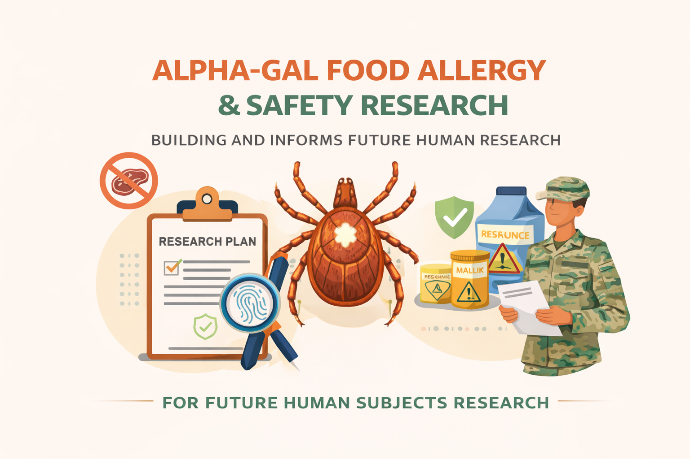

# Alpha-Gal Safety Research

I created this repository to document and organize exploratory research on food allergies, with a focus on alpha-gal syndrome.

Alpha-gal syndrome is a vector-borne condition associated with bites from the lone star tick and results in an acquired food allergy to mammalian-derived products. Unlike food intolerances, food allergies involve an immune-mediated response triggered by exposure to the allergen. The role of vectors in disease transmission adds complexity to understanding and managing conditions such as alpha-gal syndrome, particularly in populations with higher environmental or occupational exposure.

Alpha-gal syndrome has had a significant personal impact in my life and motivated the creation of this repository. Drawing on my background in operations research, I am exploring how alpha-gal syndrome affects both patients and providers. Through this work, it has become clear that risk is often driven not by lack of care, but by unclear labeling, hidden mammalian-derived ingredients, and fragmented information and education across foods, medications, and health care settings.

This repository serves as a structured space to synthesize publicly available evidence, identify safety gaps, and develop research questions that may inform future quantitative research, including human subjects research conducted under appropriate oversight.

AI tools are used in this repository for non-substantive support tasks such as generating illustrative graphics and assisting with proofreading. Research design, interpretation, and conclusions remain the responsibility of the author. Materials shared here are intended to support study design preparation, literature review, and personal professional development in alignment with applicable clinical research standards.

I am taking a deliberate, methodical approach to this work, with the hope that the research, documentation, and insights developed here may be leveraged in the future to improve processes and, ultimately, the lives of individuals affected by alpha-gal syndrome. That intent is the reason for the emphasis on rigor, transparency, and personal development throughout this repository.

# Survey Status

Right now, survey questions are being carefully drafted and refined as part of early planning work for future human subjects research. This work is being done in coordination with process improvement efforts at a teaching hospital and is focused on making sure any future studies are well designed and meet required regulatory standards.

At this stage, no surveys are active, no participants are involved, and no personal health data are being collected. The current focus is on planning, documentation, and ensuring alignment with institutional and human subjects research requirements.

During this phase, I am intentionally learning how to design survey questions that clearly separate general, preparatory questions from those that would be appropriate only after formal human subjects research approval. Online survey tools (such as SurveyMonkey) will be used only for data collection after appropriate institutional reviews and approvals are in place.

A high-level overview of the planned survey approach and an updated research summary will be shared once the study is approved to move forward.

Example: General Questions vs Human Subjects Questions

The examples below are for explanation only and are not part of an active survey.

## General (Non-Human Subjects) Example

* Which types of food labels do you think are hardest to understand for people with food allergies?

## Human Subjects Research (HSR) Example

* How many food-related allergic reactions have you personally experienced in the past 7 days?

# Intellectual Property Notice

All survey instruments, research frameworks, written materials, and original content in this repository are the original work of the author unless otherwise cited.

The author retains all intellectual property rights to the original work contained in this repository, including the right to reuse, adapt, incorporate, or commercialize this material in future research, products, or intellectual property.

Materials are shared publicly for research, educational, and preparatory purposes only. Reuse, modification, or commercial application by others beyond the terms of the license is not permitted without explicit written permission from the author.

This repository is licensed under the Creative Commons Attribution–NonCommercial–NoDerivatives 4.0 International License (CC BY-NC-ND 4.0).

