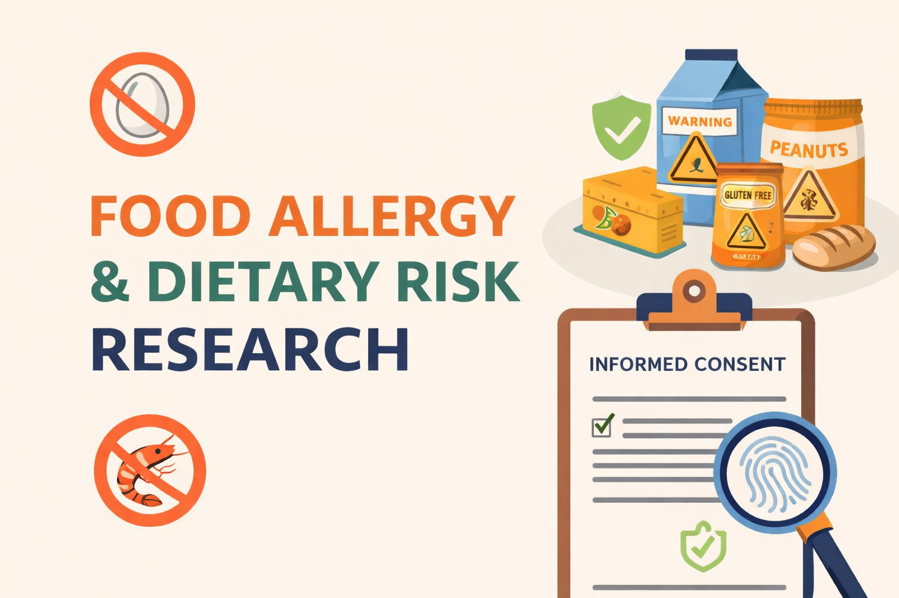

# Food Allergy and Dietary Risk Research
Exploratory research examining experiences with food allergies and dietary restrictions, with emphasis on risk awareness, labeling ambiguity, and privacy-first data collection.

## Intellectual Property Notice
All survey instruments, research frameworks, and written materials in this repository are the original work of the author.
Reuse, modification, or commercial application is not permitted without explicit written consent.

This work is licensed under the Creative Commons Attribution–NonCommercial–NoDerivatives 4.0 International License.

